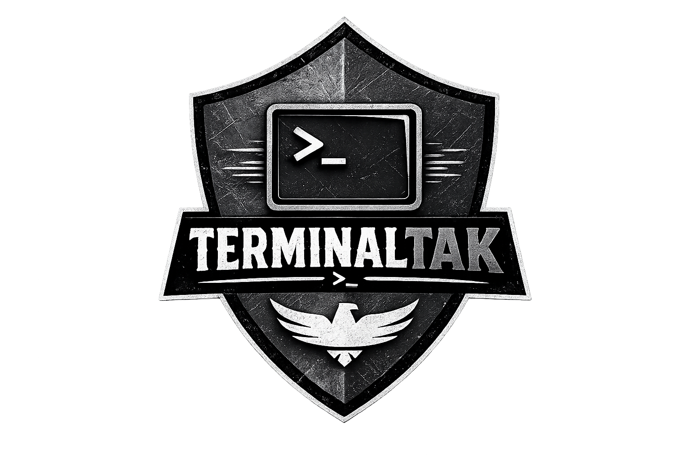
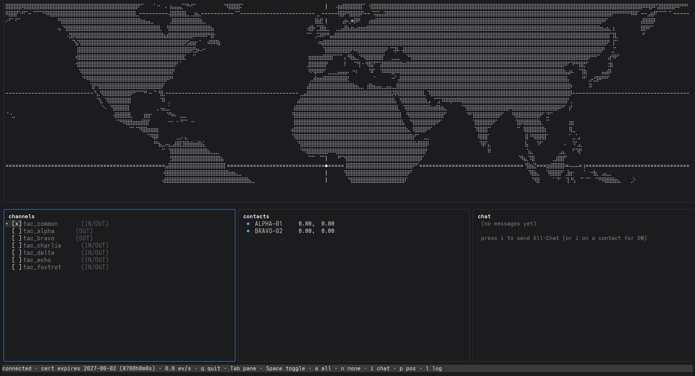
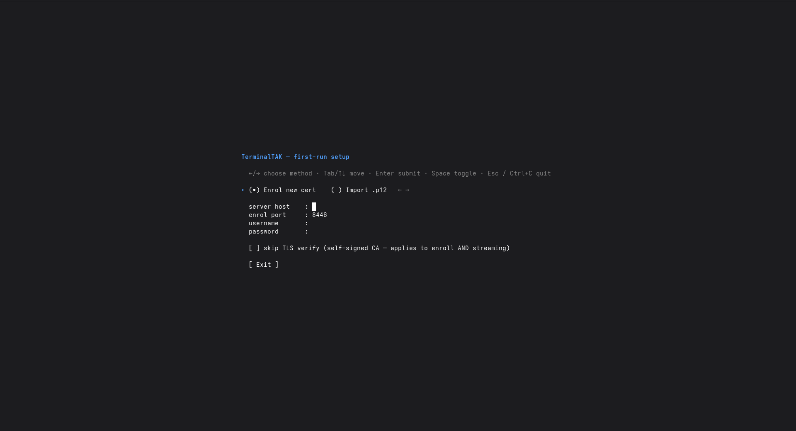
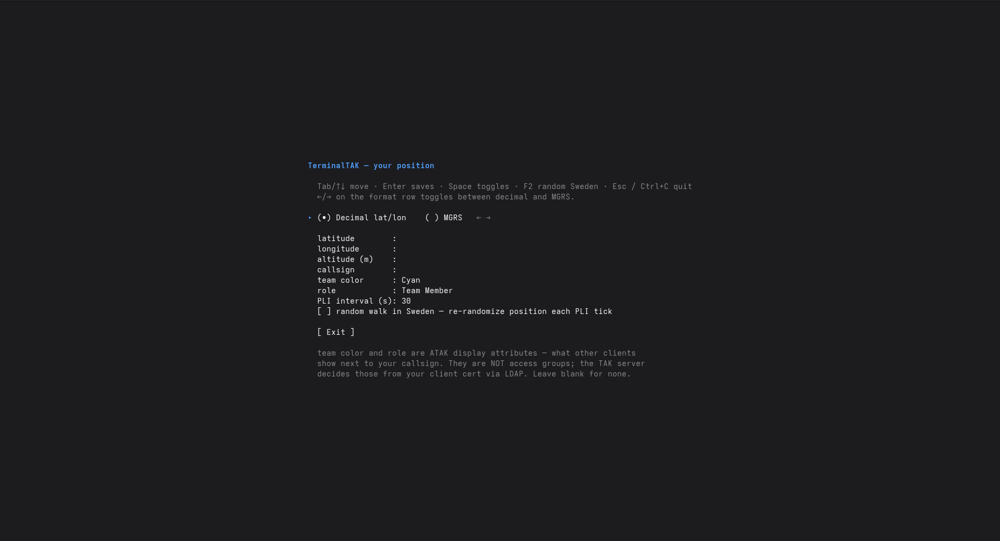

# TerminalTAK

<p align="center">
  
</p>

A terminal-native [TAK](https://tak.gov) client written in Go. Designed for SSH sessions, headless servers, and ops debugging where ATAK / WinTAK / WebTAK aren't practical.


## Screenshots



<p align="center">
  
  &nbsp;
  
</p>

## Features

- **Cert enrollment** — first-run interactive prompt enrolls a client certificate via the standard CSR flow (TAK Server `/Marti/api/tls/signClient/v2`, port 8446 / Basic Auth). Enrolls with `version=1` so the issued cert carries the `1.2.840.113549.1.9.7` extended-key-usage OID that TAK Server uses to gate server-side channel filtering.
- **`.p12` import** — alternative to enrollment for users who already have a PKCS#12 bundle. Imports leaf cert, CA chain and private key into the config dir.
- **mTLS streaming** — bidirectional CoT over TLS 1.2+ (port 8089). Reconnects with exponential backoff and a TCP keepalive of 10 s.
- **World map** — Natural Earth `ne_110m_land` coastlines embedded at build time, rendered with Braille (U+2800–U+28FF) for sub-pixel resolution. Auto-fits to the bounding box of currently active contacts plus your own position, with cell-aspect and `cos(lat)` compensation so Sweden doesn't get stretched horizontally.
- **Contacts panel** — observed PLI events, sorted by recency, with stale pruning.
- **Chat** — All-Chat broadcast plus DMs to a selected contact. Outbound GeoChat uses the `BAO.F.ATAK.<uid>` source string ATAK's reply path expects, and identifies as `ATAK-CIV` in `<takv>` so TAK Server forwards inbound DMs (the server keeps an internal allow-list of "chat-capable" platforms).
- **Channels panel** — observed access channels listed with direction marker (`(IN)`, `(OUT)`, `(IN/OUT)`). Toggle individual channels with `Space`, all on with `a`, all off with `n`. Outbound filtering is applied via `PUT /Marti/api/groups/activebits`; the contacts cache is wiped on toggle so federation tracks (which evade the server-side per-event filter) disappear immediately.
- **PLI publishing** — own position published every 5–300 s (default 30 s). Lat/lon enterable as decimal or MGRS. `F2` randomises a Swedish point. Optional **random-walk-Sweden** mode re-rolls the position on every tick — handy for testing without nudging coordinates by hand.
- **Point dropper** — `m` drops a map marker ATAK-style: aim a `+` crosshair on the map (arrow keys / `hjkl`), then pick affiliation (Friendly / Hostile / Neutral / Unknown) and a label/remarks. The marker (`a-{f,h,n,u}-G`, `<archive/>` for server persistence) is broadcast to your active channels and shown locally at once. `M` lists your markers and deletes them (broadcasting a `t-x-d-d` CoT delete).
- **CoT log overlay** — `l` opens a scrollable raw-event log with the last N CoT events for protocol debugging.
- **Skip TLS verify** — config flag for self-signed labs.

## Status

Public beta. Pinned to TAK Server 5.7.

## Requirements

- Go 1.22+
- Linux or macOS terminal supporting 256 colours and Braille glyphs
- Network access to a TAK Server's enrollment port (8446) and streaming port (8089)
- An LDAP/file-auth account on the target TAK Server, **or** a `.p12` already issued for you

## Build

```sh
go build ./cmd/terminaltak
```

This produces a single static binary (`CGO_ENABLED=0` is fine).

## Quick start

```sh
./terminaltak
```

On first run the binary creates `~/.config/terminaltak/config.yaml`, drops you into the enrolment flow, then opens the position editor. Subsequent runs go straight to the main view.

See [USER_GUIDE.md](USER_GUIDE.md) for keystroke reference, troubleshooting, and notes on TAK Server-side configuration that affect the client.

## Configuration

Config lives at `~/.config/terminaltak/config.yaml`. Key fields:

```yaml
server:
  host: takserver.example.com
  enroll_port: 8446
  stream_port: 8089
  insecure_skip_verify: false
identity:
  cert_path: ~/.config/terminaltak/cert.pem
  key_path:  ~/.config/terminaltak/key.pem
  ca_path:   ~/.config/terminaltak/ca.pem
self_pos:
  lat: 59.33
  lon: 18.07
  hae: 0
  callsign: TT-01
  group: Cyan          # ATAK team color (display only)
  role:  Team Member   # ATAK role (display only)
  uid:   <uuid v4>
  interval_seconds: 30
  random_walk_sweden: false
```

Identity files are written by the enrolment / import flow with mode `0600` (cert + key) and `0644` (CA).

## Architecture

```
cmd/terminaltak/        program entry — wires config → enroll/import → TUI
internal/
  config/               YAML load/save, ~/.config/terminaltak paths
  enroll/               /Marti/api/tls/{config,signClient/v2}, .p12 import
  cot/                  CoT XML types, streaming decoder, builders (PLI, GeoChat, markers, takp)
  takclient/            mTLS dialer (bidirectional), reconnect, Send queue
  martiapi/             /Marti/api/groups/all, /groups/activebits, /subscriptions/all
  contacts/             in-memory store, derived channel set, stale pruning
  pli/                  periodic publisher, random-walk-Sweden hook
  chat/                 GeoChat store (All-Chat + DMs), bounded ring (2000)
  markers/              local store of user-placed point-dropper markers
  worldmap/             Natural Earth GeoJSON + Braille renderer + projection
  eventlog/             ring buffer for the CoT log overlay
  mgrs/                 MGRS encode/decode (NIMA TM 8358.1)
  tui/                  Bubble Tea model / view / update
assets/
  logo.png              brand logo (header image)
  screenshots/          README screenshots
```

## License

GNU Affero General Public License v3.0 (AGPL-3.0). See [LICENSE](LICENSE).

Modifications must be released under AGPL-3.0. If you run a modified version
as a network service, you must offer its source code to users of that service.
